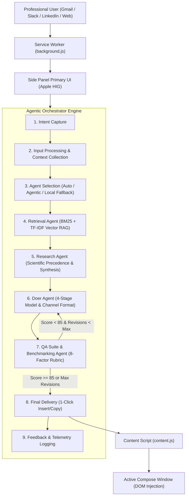
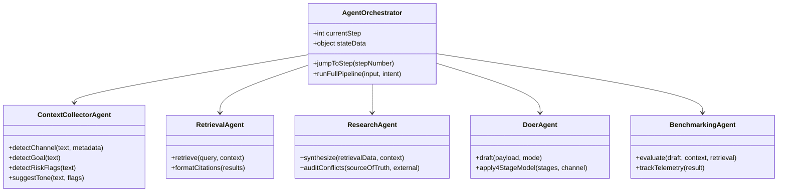

# Architecture & Design Specification: Agentic EQ Reply Chrome Extension (Manifest V3)

## 1. Executive Summary

**Agentic EQ Reply** is an enterprise-grade Manifest V3 Chrome Extension engineered for professionals to compose high-stakes, emotionally intelligent communications (Email, Slack, LinkedIn, Customer Support, and Executive Strategy Memos). 

The assistant is powered by an agentic, RAG-backed workflow anchored directly in the **Managerial EQ Handbook** (`Managerial_EQ_Handbook_FINAL.docx`). It enforces the **Universal 4-Stage Real-Time Manager Response Model** and 15 standardized scenario protocols (§4.1–§4.15) to guarantee psychological safety, boundary governance, and operational clarity.



---

## 2. Primary Source of Truth: RAG Pipeline

The primary knowledge base is the **Managerial EQ Handbook** (`/Users/moderntechnepal/Downloads/Managerial_EQ_Handbook_FINAL.docx`).

### Ingestion & Normalization (`scripts/build_corpus.py`)
1. **Extraction**: Native XML document parsing via Python standard library `zipfile` and `xml.etree.ElementTree`.
2. **Semantic Chunking**: 36 normalized section anchors preserving:
   - Section numbers (`§1.0` through `§13.0`, `Appendix A`, `Appendix B`)
   - 15 Standardized Scenario Protocols (`§4.1` to `§4.15`)
   - The Universal 4-Stage Response Model (`§2.0`)
   - JD-R Workload Diagnostics (`§1.2`, `§3.1`)
   - Ethical, Legal, Clinical, and Security Boundaries (`§8.0`)
   - Cross-Cultural Communication (`§9.0`)
3. **Structured Metadata Schema**:
   ```typescript
   interface HandbookChunk {
     id: string;
     section_number: string;
     title: string;
     category: string;
     citation: string; // e.g. "[Managerial EQ Handbook §4.1: Client Escalation]"
     evidence_base: string; // e.g. "Jordan & Troth (2002); Thomas (1977)"
     early_warning_signs: string;
     eq_competency: string;
     four_stages: {
       stage1_detect_pause: string;
       stage2_reappraise_regulate: string;
       stage3_empathetic_engagement: string;
       stage4_collaborative_resolution: string;
     };
     manager_script: string; // Exact word-for-word authoritative script
     what_not_to_do: string; // Critical failure modes and legal anti-patterns
     escalation_boundary: string; // Non-delegable statutory escalation triggers
     content: string;
     keywords: string[];
   }
   ```
4. **Client-Side Retrieval Engine (`lib/rag/rag_engine.js`)**:
   - Hybrid **BM25 + TF-IDF Vector Cosine Similarity**:
     $$\text{Score} = 0.65 \times \text{BM25}_{\text{norm}} + 0.35 \times \text{Cosine}_{\text{vector}} + \text{Boost}_{\text{scenario}}$$
   - Exact scenario title matching boost: $+8.0$
   - Early warning sign keyword intersection boost: $+2.5 \times N_{\text{matches}}$
   - Section number direct query match boost: $+10.0$
   - 100% offline capability: Zero remote dependencies for corpus search.

---

## 3. Agent Roles & Multi-Agent Architecture



| Agent | Responsibility | Core Principle / Rule |
| :--- | :--- | :--- |
| **Orchestrator / Planner** | State machine, step transitions, reversibility, telemetry | Seamless reversible workflow; persistent fallback insistence |
| **Context Collector** | Parses input text, attachments, channel constraints, risk flags | Detects PII, harassment, threats, and clinical distress |
| **Retrieval Agent** | Queries RAG corpus, extracts 4-stage protocols & manager scripts | Primary Source of Truth citation on every response |
| **Research Agent** | Synthesizes peer-reviewed behavioral research (Edmondson, Gross, Bakker) | **Rule: Source of truth wins** if external research conflicts |
| **Doer Agent** | Drafts channel-formatted replies (Email, Slack, LinkedIn, Support, Strategy) | Enforces Universal 4-Stage EQ Model |
| **Factual QA Agent** | Audits factuality against Handbook and context | Blocks liability concessions & unauthorized compensation |
| **Style & Brand QA** | Checks Apple HIG clarity, deference, depth, and tone | Removes emotional exclamation marks and hostile all-caps |
| **Safety & Privacy QA** | Enforces §8.0 boundaries (Clinical, Legal, Retaliation, PII) | Immediate block on clinical diagnosis; enforces HR escalation |
| **Tone & Channel QA** | Audits channel length, scannability, and structure | Slack brevity (< 150w); Email subject lines; Strategy depth |
| **Benchmarking Agent** | Scores draft across 8-factor rubric (0–100) and triggers revision loop | Pass threshold $\ge 85$; max 2 revision iterations |

---

## 4. Reversible Multistep Flow (Steps 1–9)

The workflow is non-linear and fully reversible. A user at Step 8 (Delivery) can jump back to Step 1 (Intent) or Step 3 (Agent Selection) without losing input context.

1. **Step 1: Intent Capture**: Select channel (Email, Slack, LinkedIn, Support, Strategy), managerial goal, and tone.
2. **Step 2: Input Processing**: Accepts pasted text, highlighted webpage selection, or uploaded files. Runs risk flag audits (e.g. §4.11 Harassment alert, §4.1 Legal liability alert).
3. **Step 3: Agent Selection**: Auto-select or manual agent selection. If no external API key is configured, defaults to **Local Fallback Mode** with persistent insistence banner.
4. **Step 4: RAG Retrieval**: Fetches top matching sections from the Managerial EQ Handbook with relevance scores and script previews.
5. **Step 5: Independent Research**: Synthesizes supporting organizational behavioral frameworks (Edmondson Psychological Safety, Gross Cognitive Reappraisal, JD-R). Resolves conflicts in favor of the Handbook.
6. **Step 6: Doer Draft**: Crafts response adhering to channel format and Universal 4-Stage Model.
7. **Step 7: QA Evaluation**: 4 specialized QA agents evaluate the draft against the 8-factor rubric. If $\text{Score} < 85$ and $\text{Revisions} < 2$, automatically loops back to Step 6 with targeted instructions.
8. **Step 8: Final Delivery**: Displays final response, Subject line, 1-click Copy, 1-click DOM injection into active tab, Markdown download, and verified Handbook citations. If on local fallback, displays insisted notice.
9. **Step 9: Feedback & Telemetry**: Captures `Accept`, `Edited`, or `Reject` actions, updates live KPI dashboard (Pass Rate, Average Score, Citation Coverage).

---

## 5. Benchmarking & Scoring Rubric (0–100)

| Rubric Factor | Max Score | Evaluation Criteria |
| :--- | :---: | :--- |
| **1. Accuracy & Truth** | 15 | No false assertions; strictly adheres to contextual facts. |
| **2. Source Fidelity** | 15 | Faithful to Managerial EQ Handbook protocols; valid section citation. |
| **3. Tone & Professionalism** | 15 | Empathetic, de-escalating, non-defensive; no passive-aggressive phrasing. |
| **4. Channel Fit** | 15 | Appropriate formatting (Slack bullets vs. formal Email vs. Strategy Brief). |
| **5. Brand & Apple HIG Deference** | 10 | Clean typography, clarity, respectful restraint, no all-caps or exclamation spam. |
| **6. Privacy & Boundary Safety** | 15 | **Critical Gate**: Zero clinical diagnosis (§8.0), zero liability concession (§4.1), mandatory HR escalation for harassment (§4.11). |
| **7. Actionability** | 10 | Explicit next operational step, clear ownership, defined checkpoint date (Stage 4). |
| **8. Conciseness** | 5 | Information density without fluff or corporate filler. |
| **Total** | **100** | **Passing Threshold: $\ge 85/100$ and Zero Critical Errors.** |

---

## 6. Design System: Apple HIG & Brand Color Palette

### Apple Human Interface Guidelines (HIG) Principles
- **Clarity**: Uncluttered layout, dynamic type sizing, standard SF typography stack (`system-ui, -apple-system, BlinkMacSystemFont, "SF Pro Text", "SF Pro Display"`).
- **Deference**: Content is king; subtle frosted glass background blurs (`backdrop-filter: blur(12px)`), 8pt grid spacing tokens (`8px`, `16px`, `24px`).
- **Depth**: Delicate layered elevations (`0 1px 3px rgba(14,17,23,0.04)`, `0 4px 16px rgba(26,58,92,0.08)`).
- **Accessibility**: Full dark mode (`prefers-color-scheme: dark`), reduced motion (`prefers-reduced-motion: reduce`), WCAG 2.1 AA compliant contrast.

### Exact Brand Color Palette Tokens
| Token | Hex Code | Semantic Role |
| :--- | :--- | :--- |
| **Navy** | `#1a3a5c` | **Primary Brand Color Anchor**. Header backgrounds, page bands, wordmarks, primary buttons. |
| **Accent Red** | `#c8440a` | **Primary Accent**. CTAs, key highlights, risk/governance alerts, fallback insistence. |
| **Gold** | `#d4a017` | **Premium / AI Marker**. AI badges, highlighted numerals, secondary borders. |
| **Teal** | `#0d7377` | **Info & Topic Identifier**. Info cards, RAG score badges, stage indicators. |
| **Purple** | `#6b3fa0` | **Tertiary Accent**. Research topics, conflict resolution tags. |
| **Ink** | `#0e1117` | **Neutrals**. Body typography, dark panels, code blocks. |
| **Paper** | `#f8f5ef` | **Neutrals**. Base page background color. |
| **Light BG** | `#f0ece3` | **Neutrals**. Card zebra striping, accordion headers. |
| **Green** | `#2d6a4f` | **Status**. Passing scores, positive validation checks only. |

---

## 7. Manifest V3 Technical Implementation

- **Manifest V3**: Complies with declarative service worker specifications and modern Chrome extension security standards.
- **Side Panel (`chrome.sidePanel`)**: Designated as the primary interface for persistent multitasking alongside Gmail, Slack, and LinkedIn.
- **Context Menus (`chrome.contextMenus`)**: Instant right-click actions on any webpage:
  - `"Draft EQ Reply with Agentic RAG"`
  - `"Analyze Conflict & 4-Stage EQ (Handbook RAG)"`
- **DOM Injection (`content/content.js`)**: Direct input injection handling both standard `<textarea>` / `<input>` and complex `contenteditable` rich text editors (Gmail, Slack Web, LinkedIn Messaging).
- **Secure Key Management**: API keys are isolated in `chrome.storage.local` and never transmitted to third parties except the directly selected provider endpoint.
